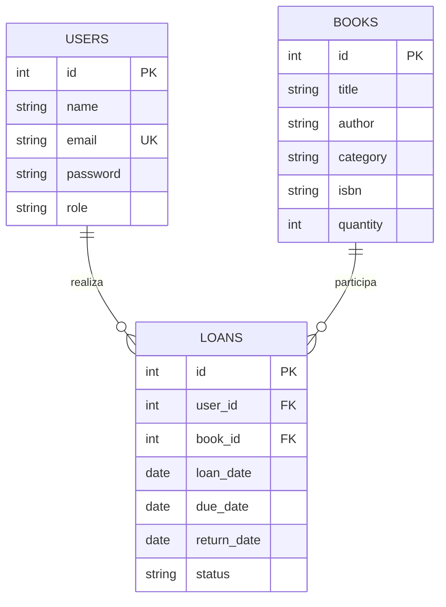

# Diagrama Entidade-Relacionamento

```mermaid
erDiagram
    USERS ||--o{ LOANS : realiza
    BOOKS ||--o{ LOANS : participa

    USERS {
        int id PK
        string name
        string email UK
        string password
        string role
    }
    BOOKS {
        int id PK
        string title
        string author
        string category
        string isbn
        int quantity
    }
    LOANS {
        int id PK
        int user_id FK
        int book_id FK
        date loan_date
        date due_date
        date return_date
        string status
    }
```
